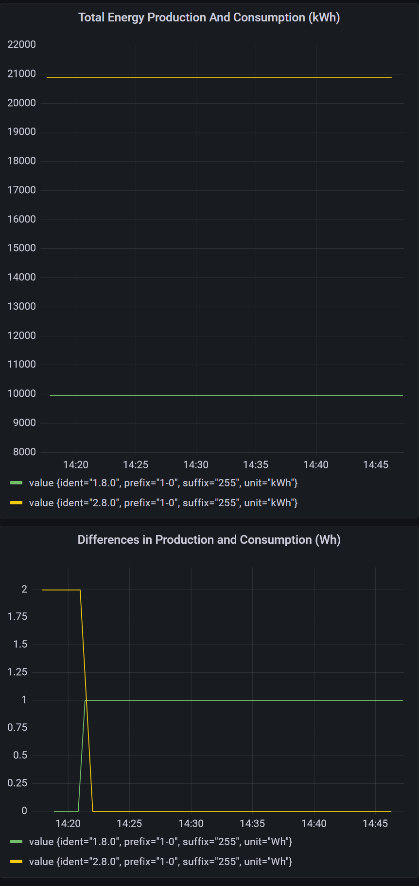
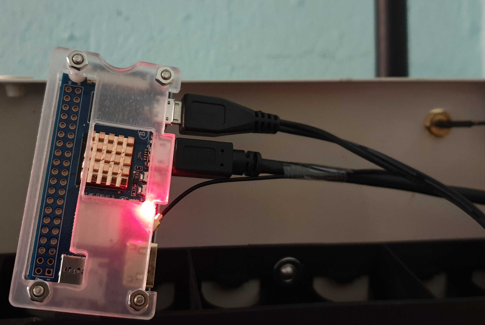
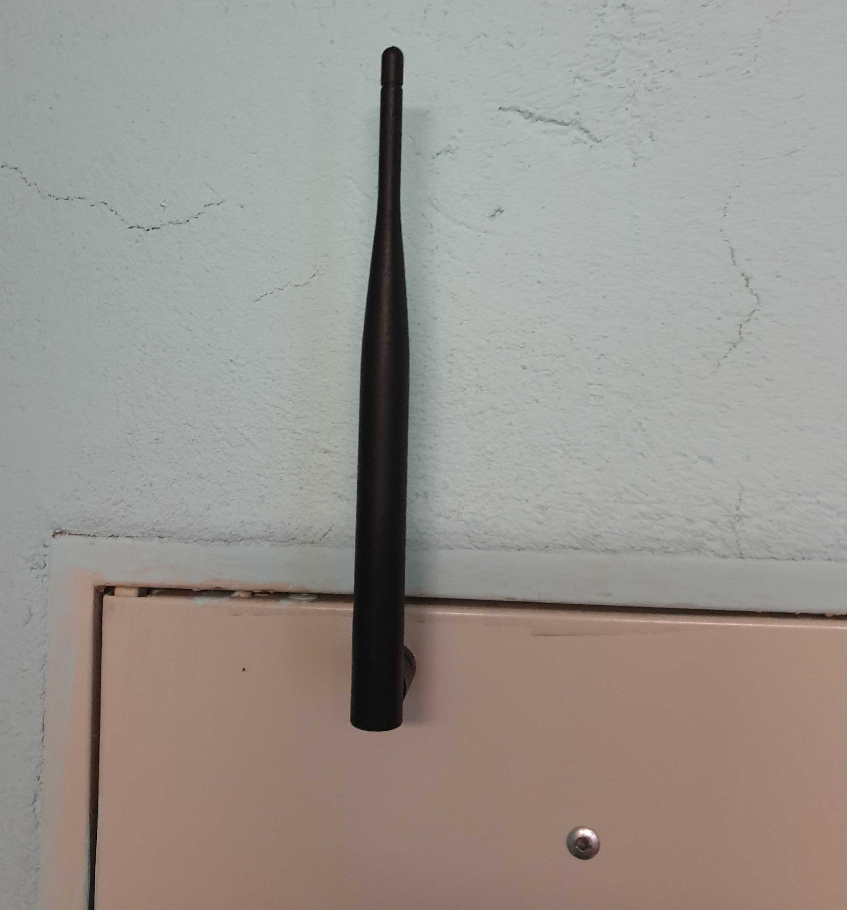
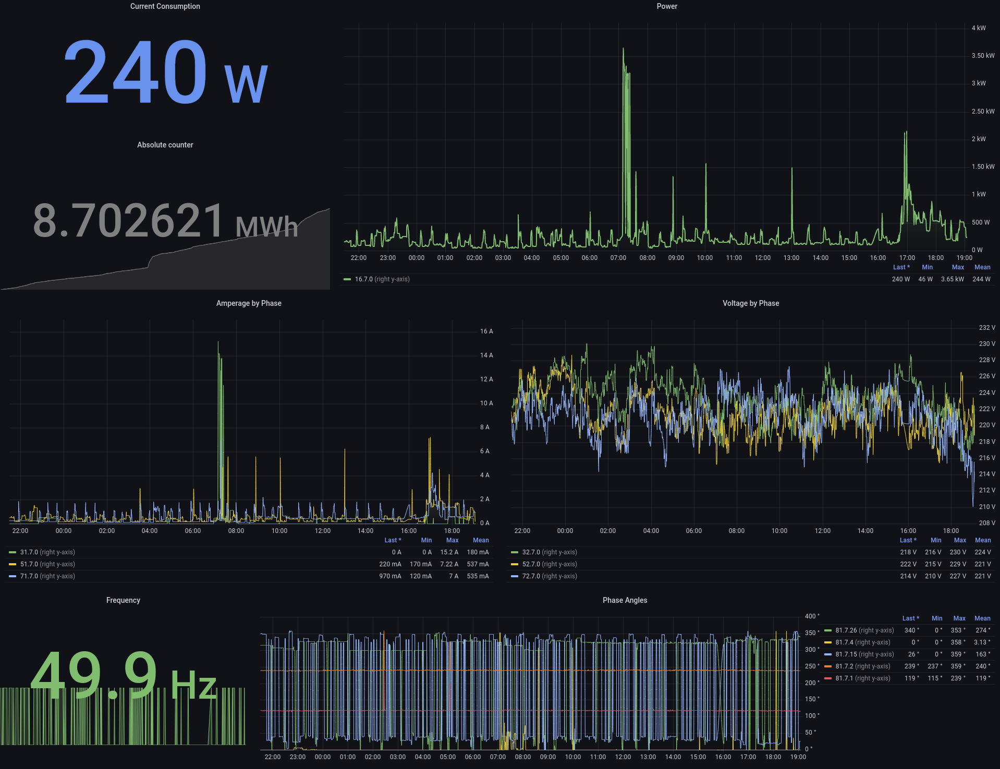

# SaMLer

The SaMLer is reading SML messages produced by a smart meter from a serial device and publishes it to a backend like InfluxDB or MySQL.

## Dependencies

It uses [libsml](https://github.com/volkszaehler/libsml) for the low level device and protocol handling, and has filesystem caching using [diskqueue](https://github.com/nsqio/go-diskqueue) to overcome (temporary) network issues.
Credits to these projects!

## Use

The dependency `libuuid` has to be installed on the target system, on Debian based systems availabe from package `uuid-runtime`.
```shell
sudo apt-get install uuid-runtime
```

There are pre-build binaries available with every [release](https://github.com/heubeck/samler/releases).

SaMLer is configured using environment variables, just run it, to let it print its options:

```shell
> ./samler.amd64
SaMLer v0.5.0  Copyright (C) 2025  Florian Heubeck
This program comes with ABSOLUTELY NO WARRANTY.
This is free software, and you are welcome to redistribute it under certain conditions.

# Configuration options, set them as ENV:
SAMLER_INFLUX_TOKEN (default: -)
SAMLER_DEVICE (default: /dev/ttyUSB0)
SAMLER_DEVICE_MODE (default: 8-N-1)
SAMLER_INFLUX_URL (default: -)
SAMLER_INFLUX_ORG (default: -)
SAMLER_MYSQL_TABLE (default: home_power)
SAMLER_DEVICE_BAUD_RATE (default: 9600)
SAMLER_CACHE_PATH (default: /home/heubeck/.samler)
SAMLER_IDENT_FILTER (default: ) # Comma separated idents to forward, e.g. "1.8.0,16.7.0"
SAMLER_DEBUG (default: false)
SAMLER_MYSQL_DSN (default: -)
SAMLER_INFLUX_MEASUREMENT (default: power)
SAMLER_BACKEND (options: influx, mysql)
SAMLER_INFLUX_BUCKET (default: home)

Please set all values without default depending on the chosen backend
```

A minimalistic run script using [Influx Cloud](https://cloud2.influxdata.com/) may look like:

```shell
#!/bin/bash
SAMLER_BACKEND=influx \
SAMLER_INFLUX_URL=https://region.provider.cloud2.influxdata.com \
SAMLER_INFLUX_TOKEN=thisIsVerySecret== \
SAMLER_INFLUX_ORG=your.influx.registered@mail.address \
/opt/samler.arm-v7
```

With MySQL the script can look like, the target table is created automatically if it doesn't exist:

```shell
#!/bin/bash
SAMLER_BACKEND=mysql \
SAMLER_MYSQL_DSN="user:password@tcp(your-database-host:3306)/samler" \
/opt/samler.arm-v7
```

Using systemd a service description may look like:

```shell
echo "[Unit]
Description=SaMLer SmartMeter Data collector
StartLimitIntervalSec=0
[Service]
Type=simple
Restart=always
RestartSec=10
User=root
ExecStart=/opt/run_samler.sh

[Install]
WantedBy=multi-user.target"  > /etc/systemd/system/samler.service
```
```shell
systemctl enable samler.service
```
```shell
systemctl start samler.service
```

## Grafana Dashboard Flux Query Examples

In case you are interested in leveraging data stored in Influx by Samler, you can use the following queries for some basic dashboards:

Total energy consumption (1.8.0) and production (2.8.0) dashboard data in kWh:

```
from(bucket: "home")
    |> range(start: v.timeRangeStart, stop: v.timeRangeStop)
	|> filter(fn: (r) => r["_measurement"] == "power")
    |> filter(fn: (r) => r["ident"] == "1.8.0" or r["ident"] == "2.8.0")
    |> map(fn: (r) => ({r with _value: r._value / 1000.0}))
    |> map(fn: (r) => ({r with unit: "kWh"}))
```

Differences in consumption (1.8.0) and poduction (2.8.0) dashboard data in Wh:

```
from(bucket: "home")
    |> range(start: v.timeRangeStart, stop: v.timeRangeStop)
		|> filter(fn: (r) => r["_measurement"] == "power")
    |> filter(fn: (r) => r["ident"] == "1.8.0" or r["ident"] == "2.8.0")
    |> difference()
```

Example data:



## Known restrictions & TODO

* By now, there's only a single serial mode supported what's reflected in the configuration defaults:
  _Baud rate `9600` and mode `8-N-1` (8 data bits, 1 stop bit, none parity)_
  That needs to be generalized.
* Smart Meter data may be properitary to electric power meter, as that's the only one I have tested SaMLer with right now.
  Please file [issues](https://github.com/heubeck/samler/issues) with devices you'd like to read.
* Timing values are hard coded and should made configurable on demand.
* My C and Go skills are only rudimentary, don't hesitate to point out improvements.
* The only supported backends are InfluxDB and MySQL by now, but it's prepared to support more, just file an [issues](https://github.com/heubeck/samler/issues).

## Contribution

Yes, please. Looking forward to your ideas.

## Sample installation

At my place, I'm using the SaMLer on a Banana Pi 2 Zero connected to an USB IR sensor attached to the electric smart meter, sending to a free Influx2 Cloud account.
The visualization is done using a free Grafana Cloud account using the InfluxDB datasource.
At night, my WLAN is disabled, SaMLer caches the measurements on its "disk" during this network outage and sends it once the connection is recovered in the morning







